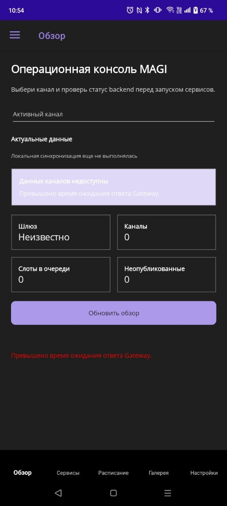
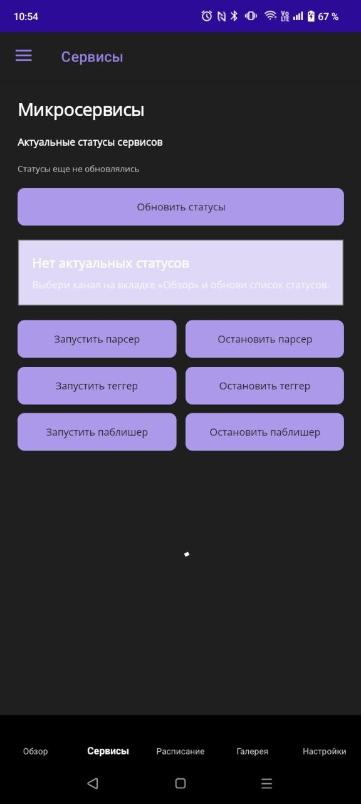
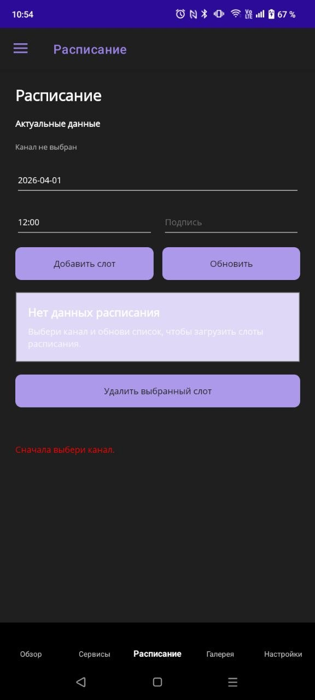
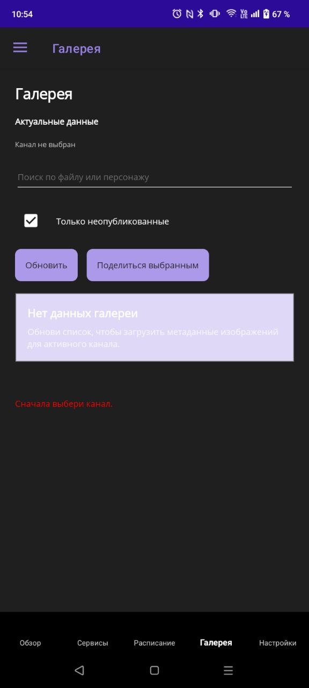
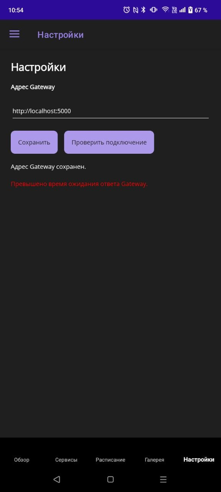

# MAGI.Mobile

MAGI.Mobile — мобильный клиент системы MAGI, реализованный на .NET MAUI.

## Назначение

Проект не дублирует весь функционал WPF AdminPanel. В текущем MVP реализованы четыре основные мобильные группы сценариев:

1. Контроль состояния API Gateway и выбранного канала.
2. Запуск и остановка микросервисов.
3. Просмотр и базовое редактирование расписания публикаций.
4. Просмотр галереи и передача метаданных изображений через системный механизм общего доступа.

Такой состав функциональности позволяет закрыть учебные требования по .NET MAUI без переработки существующей backend-архитектуры MAGI.

## Технологический стек

| Компонент | Технология |
|---|---|
| UI | .NET MAUI XAML |
| Архитектура | MVVM |
| Общая логика | C# class library |
| Сетевое взаимодействие | HttpClient + REST API Gateway |
| Локальное хранение | SQLite (`sqlite-net-pcl`) |
| Platform features | Connectivity, Share |
| Тестирование | xUnit |

## Структура решения

```text
MAGI.Mobile/
MAGI.Mobile.Core/
MAGI.Mobile.Tests/
```

### MAGI.Mobile

UI-слой MAUI-приложения:
- Shell и навигация;
- страницы `Dashboard`, `Services`, `Schedule`, `Gallery`, `Settings`;
- platform services;
- локальный SQLite-кэш.

### MAGI.Mobile.Core

Тестируемый shared-layer:
- domain-модели;
- API contracts и mapping;
- cache-aware application services;
- validators;
- viewmodels.

### MAGI.Mobile.Tests

Набор unit- и lightweight integration tests для мобильного слоя.

## Реализованные экраны

| Экран | Назначение |
|---|---|
| Dashboard | Выбор канала, статус Gateway, агрегированные метрики, индикатор live/cache |
| Services | Список сервисов, команды запуска и остановки, баннер текущего канала, время последнего обновления |
| Schedule | CRUD базовых слотов, fallback на кэш, состояние обновления, empty state |
| Gallery | Список изображений, фильтрация, fallback на кэш, системный share |
| Settings | Адрес Gateway, тест подключения, локальное сохранение настроек |

## Скриншоты интерфейса

### Обзор



### Сервисы



### Расписание



### Галерея



### Настройки



## Локальное хранение

Локально сохраняются:
- `gateway_base_url`;
- `selected_channel_id`;
- `last_sync:*`;
- список каналов;
- snapshot расписания по `channelId`;
- snapshot изображений по `channelId`.

Такой подход позволяет отображать демонстрационное состояние приложения даже при временной недоступности Gateway.

## Запуск

### 1. Запуск backend

```bash
cd ApiGateway
dotnet run
```

После запуска Gateway должен быть доступен по адресу `http://localhost:5000`.

Для Android необходимо учитывать особенности сетевого доступа:
- Android Emulator не использует `localhost` хостовой Windows-системы напрямую;
- для эмулятора должен использоваться адрес `http://10.0.2.2:5000`;
- для физического Android-устройства должен использоваться IP-адрес компьютера в локальной сети, например `http://192.168.1.10:5000`.

### 2. Сборка и запуск на Windows

Сборка и запуск являются разными действиями.

Команда `dotnet build` только компилирует проект и формирует исполняемый файл в каталоге `bin`, но не открывает окно приложения.

Сборка:

```bash
cd MAGI
dotnet build MAGI.Mobile/MAGI.Mobile.csproj -f net9.0-windows10.0.19041.0
```

Запуск через `dotnet run`:

```bash
cd MAGI
dotnet run --project MAGI.Mobile/MAGI.Mobile.csproj -f net9.0-windows10.0.19041.0
```

Запуск готового `exe` после сборки:

```bash
cd MAGI
.\MAGI.Mobile\bin\Debug\net9.0-windows10.0.19041.0\win10-x64\MAGI.Mobile.exe
```

При запуске из Visual Studio или VS Code должен быть выбран Windows target для проекта `MAGI.Mobile`.

### 3. Запуск на Android из командной строки

Для Android также необходимо различать сборку и фактический запуск.

Перед запуском должны быть выполнены следующие условия:
- установлен Android workload для .NET;
- настроен Android SDK;
- запущен Android Emulator либо подключено физическое устройство через ADB.

Проверка доступных устройств:

```bash
adb devices
```

Сборка и запуск на Android-устройстве или эмуляторе:

```bash
cd MAGI
dotnet build MAGI.Mobile/MAGI.Mobile.csproj -t:Run -f net9.0-android
```

Только сборка Android-версии без запуска:

```bash
cd MAGI
dotnet build MAGI.Mobile/MAGI.Mobile.csproj -f net9.0-android
```

Практическое различие команд:
- `dotnet build -f net9.0-android` выполняет только сборку;
- `dotnet build -t:Run -f net9.0-android` выполняет сборку, установку и попытку запуска на доступном Android-устройстве.

При наличии нескольких устройств рекомендуется оставить активным только одно целевое устройство или один эмулятор, чтобы исключить запуск не на той платформе.

### 4. Настройка Gateway URL для Android

Адреса по умолчанию:
- Windows: `http://localhost:5000`;
- Android Emulator: `http://10.0.2.2:5000`.

Если приложение запускалось ранее и на экране `Settings` был сохранён другой адрес, необходимо проверить актуальность значения вручную.

Для физического Android-устройства требуется:

1. Определить IP-адрес компьютера в локальной сети.
2. Запустить Gateway так, чтобы он слушал не только `localhost`, но и внешний интерфейс.
3. Указать в `Settings` адрес вида `http://<IP_ПК>:5000`.

Если Gateway запущен только на `http://localhost:5000`, физическое устройство не сможет установить соединение.

Практический вариант запуска Gateway для физического устройства:

```bash
cd ApiGateway
dotnet run --launch-profile http-lan
```

После этого рекомендуется выполнить следующие проверки:
- определить IP-адрес компьютера командой `ipconfig`;
- открыть на устройстве адрес `http://<IP_ПК>:5000/health`;
- при отсутствии ответа разрешить входящий доступ для `dotnet` или порта `5000` в Windows Firewall;
- на экране `Settings` приложения MAGI.Mobile должен быть сохранён адрес `http://<IP_ПК>:5000`.

## Проверка сборки

```bash
dotnet build MAGI.Mobile/MAGI.Mobile.csproj -f net9.0-windows10.0.19041.0
```

## Проверка тестов

```bash
dotnet test MAGI.Mobile.Tests/MAGI.Mobile.Tests.csproj --no-restore
```

## Ограничения текущего MVP

- отсутствует полная offline-first синхронизация;
- мобильный клиент не управляет parser/tagger settings;
- gallery отображает метаданные, а не полноценный файловый браузер изображений;
- service status остаётся live-oriented сценарием.