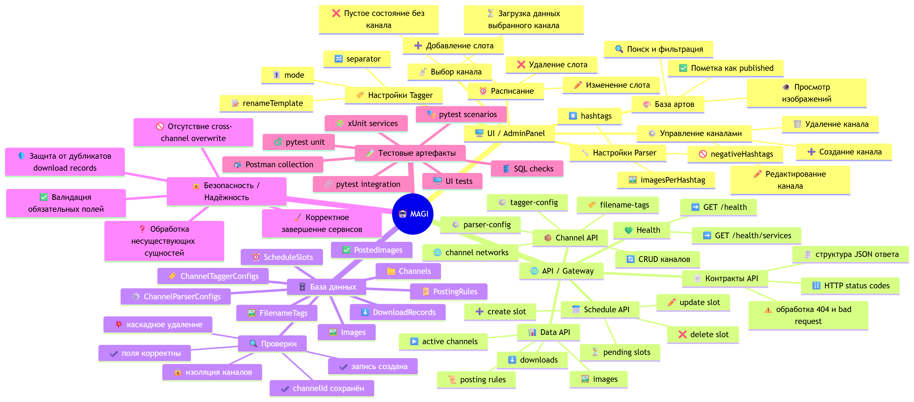
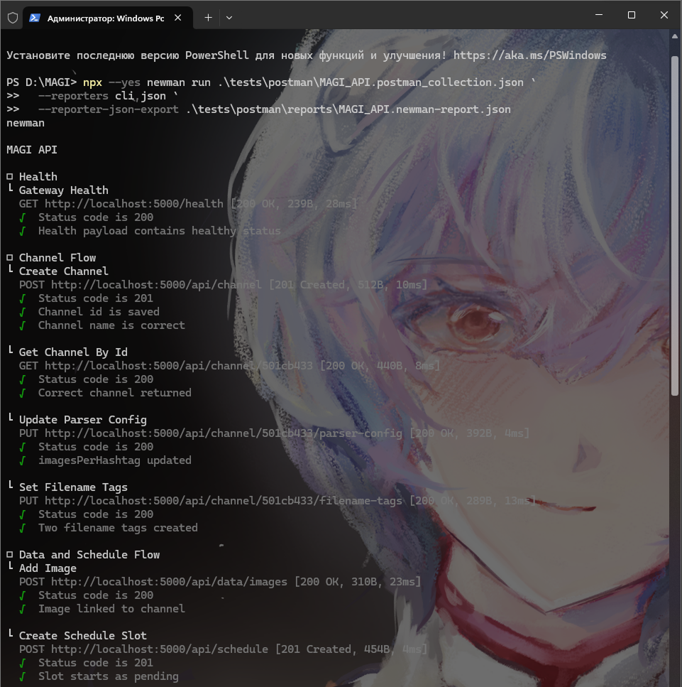
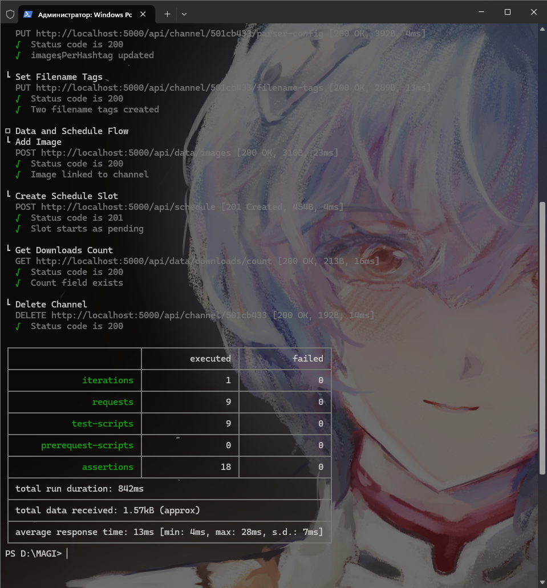
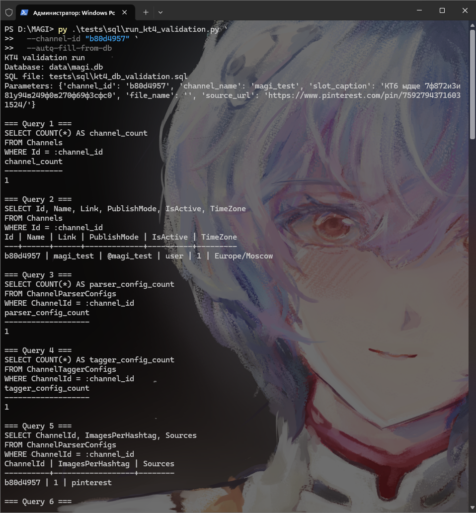
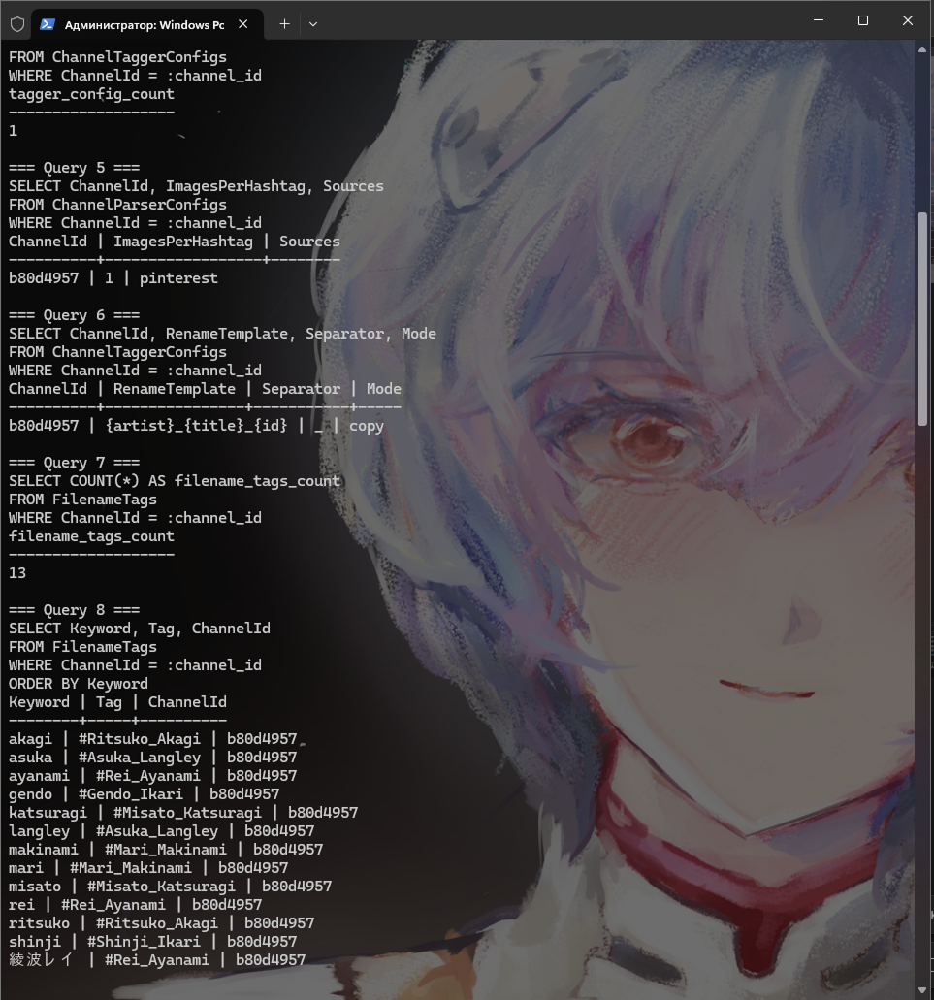
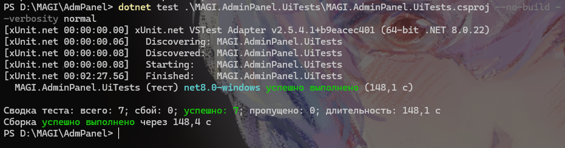

# MAGI — КТ1-КТ7: единый README по тестированию

Этот документ сводит в одно место тестовые артефакты и объясняет, как проект MAGI закрывает требования контрольных точек КТ1-КТ7. Он заменяет разрозненные тестовые README в корне папки `docs`.

---

## 1. Что именно проверяется в MAGI

MAGI — это система автоматизации контента для Telegram-каналов, в которой есть несколько уровней проверки:

- WPF-клиент `AdminPanel`;
- `API Gateway` на ASP.NET Core;
- Python-сервисы `Parser`, `FilenameTagger`, `Auto-post`;
- база данных SQLite `data/magi.db`;
- сквозные сценарии, в которых одновременно участвуют API, UI и БД.

Базовый поток системы:

```text
AdminPanel -> API Gateway -> SQLite
                       -> Parser Service
                       -> FilenameTagger Service
                       -> Publisher Service
```

Это определяет и структуру тестирования: отдельные проверки логики, API-проверки, SQL-подтверждение данных, UI-автотесты и интеграционные сценарии.

---

## 2. Как MAGI закрывает КТ1-КТ7

| КТ | Что требуется показать | Чем закрывается в MAGI | Основные доказательства |
|---|---|---|---|
| КТ1 | План тестирования | Зафиксированы объект тестирования, модули, уровни тестов, инструменты, критерии начала и завершения | Этот README, разделы 1, 3 и 4 |
| КТ2 | Карта требований и проверок | Требования разложены по веткам UI, API, БД и надёжности | [MAGI-MindMap.svg](../MAGI-MindMap.svg) |
| КТ3 | Автоматизация API | Подготовлены Postman collection и Newman-прогон для ключевых API-сценариев | [MAGI_API.postman_collection.json](../tests/postman/MAGI_API.postman_collection.json), [MAGI_API.newman-report.json](../tests/postman/reports/MAGI_API.newman-report.json) |
| КТ4 | Проверка БД | Есть SQL-файл для ручной валидации SQLite после API- и UI-сценариев | [kt4_db_validation.sql](../tests/sql/kt4_db_validation.sql) |
| КТ5 | UI-автотесты | Реализован отдельный WPF UI test suite на Appium + WinAppDriver с Page Object Model | [MAGI.AdminPanel.UiTests.csproj](../AdmPanel/MAGI.AdminPanel.UiTests/MAGI.AdminPanel.UiTests.csproj) |
| КТ6 | Сквозной сценарий API + UI + DB | Реализован интеграционный тест, создающий данные через API, изменяющий их через UI и подтверждающий результат в SQLite | [IntegratedApiUiDbTests.cs](../AdmPanel/MAGI.AdminPanel.UiTests/Tests/IntegratedApiUiDbTests.cs) |
| КТ7 | Итоговый отчёт по тестированию | В одном документе собраны покрытие, результаты, артефакты и вывод по готовности проекта | Этот README целиком |

---

## 3. План тестирования MAGI

### Цель

Подтвердить, что MAGI корректно выполняет полный жизненный цикл работы с контентом Telegram-каналов:

- управление каналами и их настройками;
- сохранение и чтение данных из SQLite;
- настройку парсинга, тегирования и публикации;
- формирование расписания публикаций;
- корректное взаимодействие AdminPanel, API Gateway и Python-сервисов.

### Объект тестирования

Проверяются следующие компоненты:

- `AdmPanel/WpfApp1` — пользовательский интерфейс и сценарии работы оператора;
- `ApiGateway` — REST API, оркестрация и работа с БД;
- `Parser`, `FilenameTagger`, `Auto-post` — микросервисы обработки контента;
- `data/magi.db` — фактическое состояние данных после выполнения сценариев.

### Уровни тестирования

| Уровень | Реализация в проекте |
|---|---|
| Unit | Python: `tests/unit/`; C#: `ApiGateway.Tests/Unit/` |
| Integration | `tests/integration/` через реальные HTTP-запросы к Gateway |
| Scenario / E2E | `tests/scenarios/` и UI-сценарии для пользовательских потоков |
| Manual / Exploratory | Swagger, SQL-проверки SQLite, визуальная проверка UI |

### Инструменты

| Задача | Инструмент |
|---|---|
| Python unit / integration / scenario | `pytest` |
| .NET unit-тесты | `xUnit`, `EF Core InMemory` |
| API-автоматизация | `Postman`, `Newman` |
| Проверка БД | `sqlite3`, DB Browser for SQLite, DBeaver |
| UI-автоматизация WPF | `Appium Windows Driver`, `WinAppDriver` |
| Документация и карта покрытия | Markdown, Mermaid, SVG |

### Критерии начала и завершения

Начало тестирования:

- проект собирается без критических ошибок;
- API Gateway запускается локально;
- тестовая БД создаётся автоматически;
- установлены Python- и .NET-зависимости.

Завершение тестирования:

- ключевые unit- и integration-проверки выполняются успешно;
- API-сценарии покрыты Postman/Newman;
- SQL-проверки подтверждают корректность состояния SQLite;
- для критических пользовательских сценариев есть UI- или интеграционные проверки.

Так закрывается КТ1: тестирование в MAGI спланировано по модулям, уровням и инструментам, а не сведено к набору случайных запусков.

---

## 4. Карта требований и проверок

Для КТ2 используется mind map:

- [MAGI-MindMap.png](images/kt2/MAGI-MindMap.png)

Карта разбивает требования на четыре основные ветки:

- `UI / AdminPanel` — выбор канала, управление каналами, parser settings, tagger settings, расписание, база артов;
- `API / Gateway` — health-check, CRUD каналов, parser-config, tagger-config, filename-tags, schedule, data endpoints;
- `База данных` — таблицы, связи, `ChannelId`, каскадное удаление, изоляция данных разных каналов;
- `Надёжность` — обработка ошибок, 404, дубликатов, некорректных сценариев и cross-channel overwrite.

Практический смысл карты: она показывает, что для диплома зафиксированы не только тесты, но и сама логика покрытия требований. Это и есть закрытие КТ2.



---

## 5. КТ3 — автоматизация API

Для проверки API Gateway подготовлены:

- [MAGI_API.postman_collection.json](../tests/postman/MAGI_API.postman_collection.json);
- [MAGI_API.newman-report.json](../tests/postman/reports/MAGI_API.newman-report.json).

Коллекция покрывает ключевые сценарии:

- проверка доступности Gateway;
- создание и чтение канала;
- обновление parser-config;
- установка filename-тегов;
- добавление изображения;
- создание слота расписания;
- базовая проверка статистики downloads;
- удаление тестового канала.

Перед запуском нужно:

- открыть PowerShell;
- перейти в корень репозитория `D:\MAGI`;
- убедиться, что `API Gateway` уже запущен;

Запуск из PowerShell из корня проекта:

```powershell
Set-Location D:\MAGI

npx --yes newman run .\tests\postman\MAGI_API.postman_collection.json `
  --reporters cli,json `
  --reporter-json-export .\tests\postman\reports\MAGI_API.newman-report.json
```





По ранее зафиксированным результатам коллекция была успешно выполнена: `9 requests`, `18 assertions`, `0 failures`.

Это закрывает КТ3, потому что API проверяется автоматически и воспроизводимо, а не только вручную через Swagger.

---

## 6. КТ4 — SQL-проверки состояния БД

Для проверки SQLite используется файл:

- [kt4_db_validation.sql](../tests/sql/kt4_db_validation.sql)
- [run_kt4_validation.py](../tests/sql/run_kt4_validation.py)

SQL-проверки подтверждают:

- наличие записи в `Channels`;
- автосоздание `ChannelParserConfigs` и `ChannelTaggerConfigs`;
- корректность `FilenameTags`, `Images`, `DownloadRecords`, `ScheduleSlots`;
- отсутствие смешивания данных между каналами;
- каскадное удаление зависимых сущностей после удаления канала.

Основные таблицы контроля:

- `Channels`
- `ChannelParserConfigs`
- `ChannelTaggerConfigs`
- `FilenameTags`
- `Images`
- `PostedImages`
- `ScheduleSlots`
- `PostingRules`
- `DownloadRecords`

Проверка КТ4 выполняется без SQLite IDE напрямую из PowerShell, что позволяет одновременно показать команду запуска и фактический результат SQL-валидации.

Как запускать:

1. Выполнить API- или UI-сценарий, который создаёт тестовые данные.
2. Открыть PowerShell и перейти в корень проекта `D:\MAGI`.
3. Запустить проверку через готовый скрипт, который выполняет [kt4_db_validation.sql](../tests/sql/kt4_db_validation.sql) против `data\magi.db`.

Пример запуска с автоматическим подбором актуальных значений из текущей БД:

```powershell
Set-Location D:\MAGI

py .\tests\sql\run_kt4_validation.py `
  --channel-id "b80d4957" `
  --auto-fill-from-db
```

Для подтверждения каскадного удаления после удаления канала используется отдельный прогон:

```powershell
Set-Location D:\MAGI
py .\tests\sql\run_kt4_validation.py --channel-id "b80d4957" --auto-fill-from-db --include-post-delete-checks
```

Результат выполнения показывает, что канал, конфигурации, теги, загрузки и слоты расписания действительно присутствуют в SQLite, а SQL-проверка выполняется воспроизводимо без графических инструментов.





Это закрывает КТ4, потому что результат тестов подтверждается не только ответами API или поведением UI, но и фактическим состоянием БД.

---

## 7. КТ5 — автотесты WPF-интерфейса

Для desktop UI создан отдельный проект:

- [MAGI.AdminPanel.UiTests.csproj](../AdmPanel/MAGI.AdminPanel.UiTests/MAGI.AdminPanel.UiTests.csproj)

Основные части набора:

- [MainWindowPage.cs](../AdmPanel/MAGI.AdminPanel.UiTests/PageObjects/MainWindowPage.cs)
- [ChannelManagementWindowPage.cs](../AdmPanel/MAGI.AdminPanel.UiTests/PageObjects/ChannelManagementWindowPage.cs)
- [ParserSettingsWindowPage.cs](../AdmPanel/MAGI.AdminPanel.UiTests/PageObjects/ParserSettingsWindowPage.cs)
- [TaggerSettingsWindowPage.cs](../AdmPanel/MAGI.AdminPanel.UiTests/PageObjects/TaggerSettingsWindowPage.cs)
- [SmokeUiTests.cs](../AdmPanel/MAGI.AdminPanel.UiTests/Tests/SmokeUiTests.cs)
- [ScheduleUiTests.cs](../AdmPanel/MAGI.AdminPanel.UiTests/Tests/ScheduleUiTests.cs)

Почему выбран именно этот стек:

- `AdminPanel` — это WPF desktop application, а не web-приложение;
- поэтому вместо Selenium для браузера используется desktop WebDriver-подход: `Appium Windows Driver` + `WinAppDriver`;
- тесты оформлены через Page Object Model, чтобы сценарии оставались поддерживаемыми.

Покрытые UI-сценарии:

1. загрузка главного окна MAGI;
2. открытие окна управления каналами;
3. создание канала через UI;
4. открытие и сохранение parser settings;
5. открытие и сохранение tagger settings;
6. создание слота расписания через UI.

Команда запуска:

```powershell
Set-Location D:\MAGI\AdmPanel
dotnet test .\MAGI.AdminPanel.UiTests\MAGI.AdminPanel.UiTests.csproj --verbosity normal
```

Предварительные условия:

- собран `MAGIAdmin.exe`;
- запущен `API Gateway`;
- запущен `WinAppDriver`.

Актуальный контекст по проекту:

- UI test suite собран и приведён в рабочее состояние;
- в текущем Windows-окружении были успешно прогнаны ключевые отдельные UI-сценарии, включая создание канала, сохранение parser/tagger settings и создание слота расписания;
- стабильность набора обеспечена за счёт `AutomationId`, Page Object Model и отключения параллельного запуска UI-тестов.



Это закрывает КТ5: в MAGI пользовательский интерфейс не проверяется только вручную, для него есть отдельный автоматизированный набор тестов.

---

## 8. КТ6 — интеграционный сценарий API + UI + DB

Сквозной сценарий реализован в файле:

- [IntegratedApiUiDbTests.cs](../AdmPanel/MAGI.AdminPanel.UiTests/Tests/IntegratedApiUiDbTests.cs)

Для SQL-подтверждений внутри сценария используются:

- [SqliteAssertions.cs](../AdmPanel/MAGI.AdminPanel.UiTests/Infrastructure/SqliteAssertions.cs)

Логика проверки:

1. канал создаётся через API;
2. SQLite подтверждает появление канала и связанных конфигов;
3. через UI создаётся слот расписания;
4. SQLite подтверждает появление записи в `ScheduleSlots`;
5. канал удаляется через API;
6. SQLite подтверждает каскадное удаление зависимых данных.

Почему это важно:

- тест связывает три уровня системы;
- проверяется не только «ответ сервера» или «кнопка в UI», а целостный бизнес-поток;
- именно такой сценарий лучше всего показывает, что модули MAGI работают согласованно.

Это и есть закрытие КТ6: в проекте есть полноценный API + UI + DB интеграционный сценарий, а не набор изолированных тестов.

---

## 9. КТ7 — итоговый отчёт по тестированию

Итог КТ7 в рамках MAGI формируется этим документом и реальными тестовыми артефактами в репозитории.

### Что уже подготовлено как доказательная база

| Область | Доказательство |
|---|---|
| Архитектура и объект тестирования | [README.md](../README.md) |
| Python unit / integration / scenario | [tests](../tests) |
| C# unit-тесты Gateway | [ApiGateway.Tests](../ApiGateway.Tests) |
| API-автоматизация | [MAGI_API.postman_collection.json](../tests/postman/MAGI_API.postman_collection.json) |
| Newman report | [MAGI_API.newman-report.json](../tests/postman/reports/MAGI_API.newman-report.json) |
| SQL validation | [kt4_db_validation.sql](../tests/sql/kt4_db_validation.sql) |
| UI-автотесты | [MAGI.AdminPanel.UiTests](../AdmPanel/MAGI.AdminPanel.UiTests) |

### Сводка по тестовым направлениям

| Набор проверок | Состояние |
|---|---|
| Python unit-тесты | Реализованы и ранее зафиксированы как успешно пройденные |
| Python integration-тесты | Реализованы и выполняются при поднятом Gateway |
| Python scenario-тесты | Реализованы как сквозные бизнес-сценарии |
| C# xUnit-тесты | Реализованы для сервисов и работы с данными |
| Postman / Newman | Есть коллекция и отчёт без ошибок |
| SQL validation | Есть отдельный файл запросов для проверки состояния SQLite |
| UI-автотесты WPF | Есть отдельный проект и подтверждённые рабочие сценарии |
| API + UI + DB integration | Есть отдельный интеграционный сценарий уровня системы |

### Итоговый вывод

Проект MAGI закрывает требования КТ1-КТ7 следующим образом:

- КТ1 закрывается формализованным планом тестирования;
- КТ2 закрывается картой требований и покрытия;
- КТ3 закрывается автоматизированной проверкой API через Postman/Newman;
- КТ4 закрывается SQL-проверками реального состояния SQLite;
- КТ5 закрывается отдельным набором UI-автотестов для WPF AdminPanel;
- КТ6 закрывается интеграционным сценарием API + UI + DB;
- КТ7 закрывается итоговым сводным описанием результатов, артефактов и готовности проекта к защите.

Практически это означает, что тестирование MAGI организовано по уровням и подтверждается как кодом тестов, так и доказательными артефактами в репозитории.